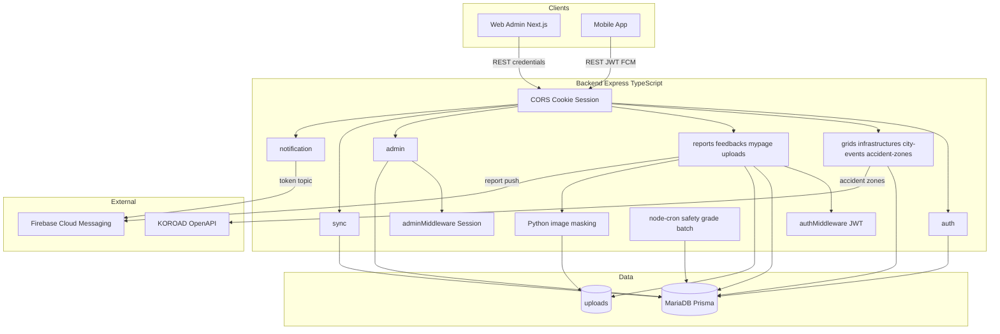
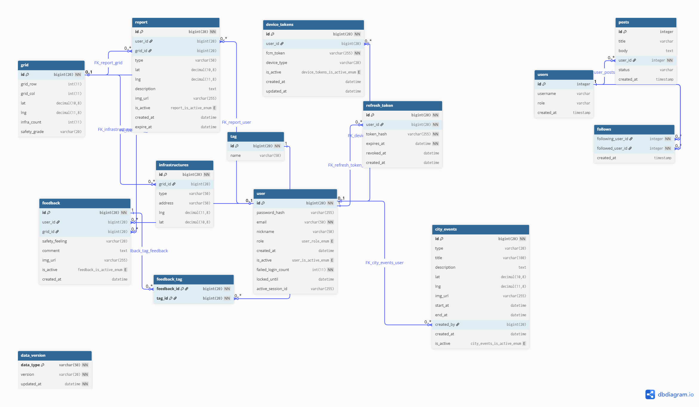

# 🗺️ 치안 안전 지도 (Backend)

공공데이터로는 알 수 없는 체감 안전도를, 실시간 제보와 평가로 채운 치안 정보 지도 서비스입니다.

[Web 버전 페이지 링크](https://github.com/Choi-JB/public_safety_map_web)  
[App 버전 페이지 링크](https://github.com/Choi-JB/public_safety_map_app)

---

## 📝 개요 Description

이 프로젝트는 치안 안전 지도의 *백엔드 API 서버*입니다.  
웹·앱 클라이언트가 공통으로 사용하는 REST API를 제공하며, MariaDB에 격자·인프라·제보·피드백 등을 저장·조회합니다.

주요 역할은 다음과 같습니다.

- *일반 유저:* JWT 기반 인증, 제보·피드백·마이페이지, 이미지 업로드(마스킹)
- *관리자:* 세션 기반 인증, 제보/피드백/도시행사 관리, 대시보드
- *지도 데이터:* 격자·인프라 조회, 앱 오프라인 캐시용 sync(버전·페이지네이션)
- *알림:* 제보 등록 시 Firebase Cloud Messaging(FCM) 푸시
- *외부 연동:* 도로교통공단 사고다발구역 OpenAPI 프록시
- *배치:* 매일 자정(KST) 격자 안전등급 재산출 (`node-cron`)

---

## 🎬 DEMO

[데모 버전 링크](https://43-202-197-59.nip.io/health)

자세한 건 API 명세서 참조

---

## 🚀 실행 방법 Getting Started

```bash
# 1. 의존성 설치
npm install

# 2. 환경변수 설정
#    .env.example을 복사해 .env 생성 후 값 채우기
#    - DATABASE_URL, JWT_SECRET, SESSION_SECRET (필수) (아래 생성방법 참조)
#    - FIREBASE_* (FCM 알림)
#    - KOROAD_AUTH_KEY (사고다발구역, 선택)

# 3. Prisma Client 생성
npx prisma generate

# 4. (선택) 안전등급 배치 1회 실행
npx ts-node --transpile-only src/jobs/runScore.ts

# 5. (최초 1회) 이미지 마스킹용 Python venv
cd masking
python -m venv .venv
.\.venv\Scripts\python.exe -m pip install -r requirements.txt
cd ..

# 6. 개발 서버 실행
npm run dev

# 7. DB 연결 확인
#    http://localhost:{PORT}/health/db
```

### 🔑 JWT_SECRET / SESSION_SECRET 생성

유출이 의심되거나 최초 설정할 때, 아래 명령을 *두 번* 실행해 나온 값을 각각 `.env`에 넣습니다.

```bash
node -e "console.log(require('crypto').randomBytes(32).toString('hex'))"
```

*교체 시*

- `SESSION_SECRET` 변경 → 관리자 세션 전부 무효 → 재로그인 필요
- `JWT_SECRET` 변경 → access token 전부 무효 (유효한 refresh가 있으면 `/auth/refresh`로 복구 가능)

---

## 🛠️ 기술 스택 Stack

- *Runtime / Language:* Node.js, TypeScript
- *Framework:* Express
- *ORM / DB:* Prisma, MariaDB
- *Auth:* JWT (`jsonwebtoken`) + Refresh Token, express-session (관리자), bcrypt
- *Push:* Firebase Admin SDK (FCM)
- *Upload:* multer, Python 이미지 마스킹
- *Batch:* node-cron (안전등급 일일 배치)
- *External API:* 도로교통공단 사고다발구역 OpenAPI
- *Deploy:* Docker / Docker Compose

---

## 📁 프로젝트 구조 Project Structure

```text
backend/
|-- docs/                              # 설계·명세 문서
|-- masking/                           # 이미지 마스킹 (Python)
|   |-- mask_cli.py                    # 마스킹 CLI 진입점
|   |-- masking.py                     # 얼굴 마스킹 로직
|   `-- requirements.txt               # Python 의존성
|-- prisma/
|   `-- schema.prisma                  # DB 스키마
|-- src/
|   |-- config/
|   |   |-- env.ts                     # 필수 환경변수 검증
|   |   |-- firebase.ts                # Firebase Admin (FCM)
|   |   |-- koroad.ts                  # 사고다발구역 API 상수
|   |   `-- prismaClient.ts            # PrismaClient 싱글톤
|   |-- controllers/
|   |   |-- accidentZone.controller.ts # 사고다발구역 조회
|   |   |-- admin.controller.ts        # 관리자 대시보드·제보/피드백/행사 관리
|   |   |-- auth.controller.ts         # 로그인·회원가입·로그아웃·refresh
|   |   |-- city.controller.ts         # 도시 행사 공개 조회
|   |   |-- feedback.controller.ts     # 유저 피드백
|   |   |-- grid.controller.ts         # 격자·격자 내 인프라·상세
|   |   |-- infra.controller.ts        # 반경 기준 인프라 조회
|   |   |-- mypage.controller.ts       # 마이페이지 (내 제보·피드백)
|   |   |-- notification.controller.ts # FCM 토큰 등록·테스트 알림
|   |   |-- report.controller.ts       # 유저 제보 CRUD
|   |   |-- sync.controller.ts         # 앱 캐시용 버전·grid/infra 동기화
|   |   `-- upload.controller.ts       # 이미지 업로드
|   |-- middlewares/
|   |   |-- auth.middleware.ts         # JWT 검증 (일반 유저)
|   |   `-- admin.middleware.ts        # 세션 검증 (관리자)
|   |-- routes/
|   |   |-- accidentZone.routes.ts     # /accident-zones
|   |   |-- admin.routes.ts            # /admin/*
|   |   |-- auth.routes.ts             # /auth/*
|   |   |-- city.routes.ts             # /city-events
|   |   |-- feedback.routes.ts         # /feedbacks
|   |   |-- grid.routes.ts             # /grids
|   |   |-- health.routes.ts           # /health
|   |   |-- infra.routes.ts            # /infrastructures
|   |   |-- mypage.routes.ts           # /mypage
|   |   |-- notification.routes.ts     # /notification
|   |   |-- report.routes.ts           # /reports
|   |   |-- sync.routes.ts             # /sync
|   |   `-- upload.routes.ts           # /uploads
|   |-- jobs/                          # 안전등급 배치
|   |   |-- runScore.ts                # CLI 진입점
|   |   |-- scoreOps.ts                # 점수 산출·DB 반영
|   |   |-- scoreScheduler.ts          # cron 스케줄 등록
|   |   `-- weights.ts                 # 가중치·등급 매핑
|   |-- type/
|   |   `-- express-session.d.ts       # 세션·Request 타입 확장
|   |-- utils/
|   |   |-- commonUtils.ts             # refresh token 해시 등
|   |   |-- dateUtils.ts               # KST 날짜 유틸
|   |   |-- gridUtils.ts               # 격자 좌표 계산
|   |   |-- imageUpload.ts             # multer 이미지 저장
|   |   |-- imgMasking.ts              # 마스킹 파이프라인 연동
|   |   |-- koroadAccident.service.ts  # 공단 사고다발구역 조회·캐시
|   |   `-- notification.service.ts    # FCM 푸시 전송
|   `-- app.ts                         # Express 앱·라우트 마운트
|-- uploads/                           # 업로드 이미지 저장
|-- .env.example                       # 환경변수 예시
|-- package.json
`-- README.md
```

---

## 🏗️ 아키텍쳐 구조도 Architecture



### 요청 흐름 요약

| 구분 | 인증 | 주요 경로 |
|---|---|---|
| 일반 유저 | JWT + Refresh | 제보·피드백·마이페이지·업로드 |
| 관리자 | Session 쿠키 | `/admin/*` |
| 공개 | 없음 | 격자·인프라·행사·사고다발·sync·health |
| 비동기 | — | FCM 푸시, 일일 안전등급 cron, DB Event Scheduler |

---

## 🗄️ ERD



주요 테이블: `user`, `grid`, `infrastructures`, `report`, `feedback`, `tag`, `feedback_tag`, `device_tokens`, `refresh_token`, `city_events`, `data_version`

```text
user: 유저 정보
grid : 지도에 표시할 격자 데이터
infrastructures, data_version : 인프라 데이터
report : 유저 제보 내용
feedback, tag, feedback_tag : 유저들의 구역 평가

device_tokens : 알림 전송을 위한 fcm_token 저장 테이블
refresh_token : refresh token 정보
city_evnets : 도시 정보
```
docs/public_safety_DB.sql 참조

---

## 📡 API 명세

`/docs/API명세서.md` 참조

[API 명세서 링크](https://treasure-muscle-85a.notion.site/API-3c6c1c44bf488063b15ff85ac1498c3f?pvs=74)

---

## ⏰ DB 스케줄러

```sql
-- 취소되거나 만료된 토큰 정리
CREATE EVENT cleanup_refresh_tokens
ON SCHEDULE EVERY 1 DAY
STARTS CURRENT_TIMESTAMP
DO
    DELETE FROM refresh_token
    WHERE
        expires_at < DATE_SUB(NOW(), INTERVAL 7 DAY)
        OR revoked_at < DATE_SUB(NOW(), INTERVAL 7 DAY);

-- 만료된 제보 정보 지도에 미표시
CREATE EVENT update_expired_reports
ON SCHEDULE EVERY 1 DAY
DO
    UPDATE report
    SET is_active = 'N'
    WHERE expire_at < NOW()
      AND is_active = 'Y';
```

---

## 👤 본인 역할 Role & Contribution

로그인, 관리자 페이지, FCM 알림, 마이페이지
