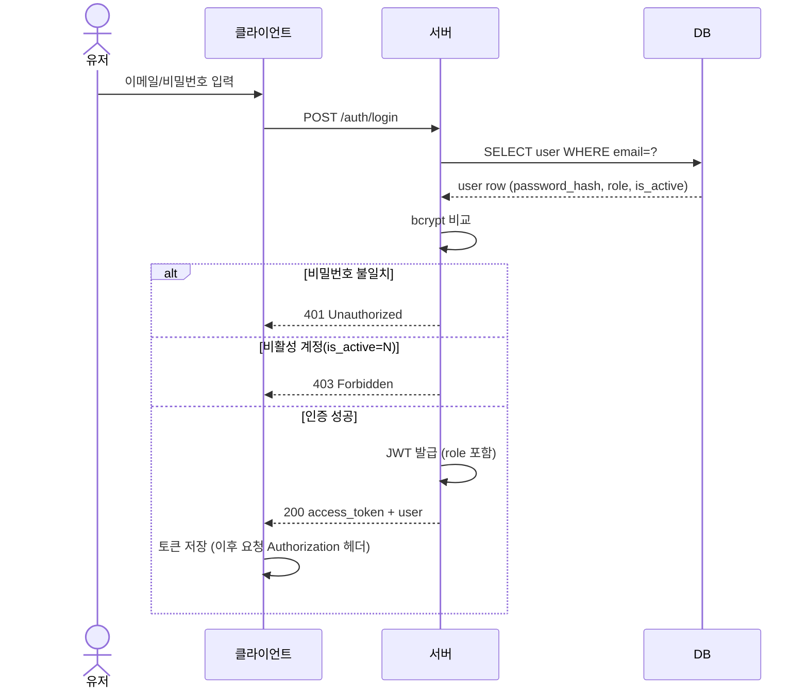
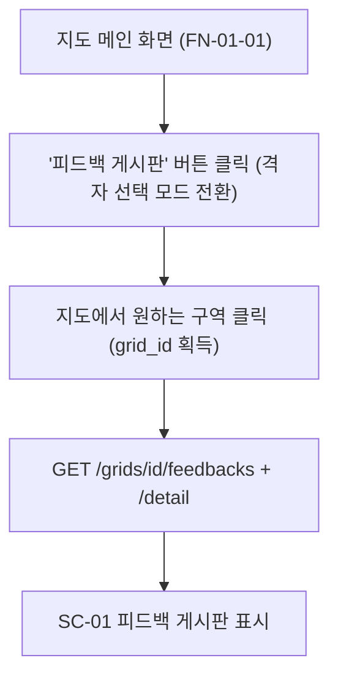
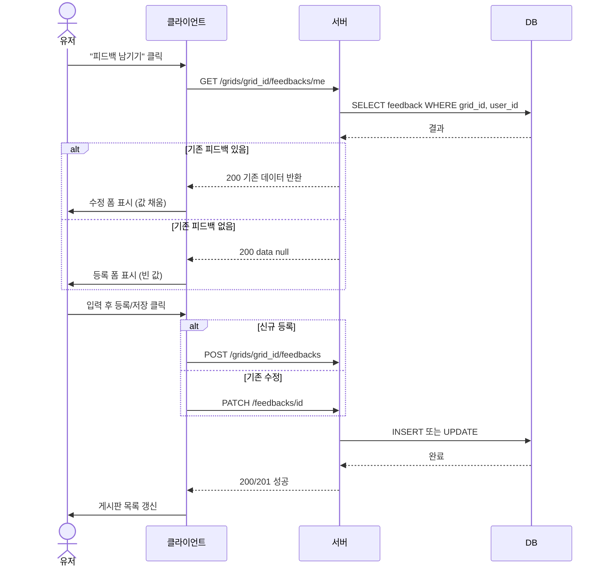
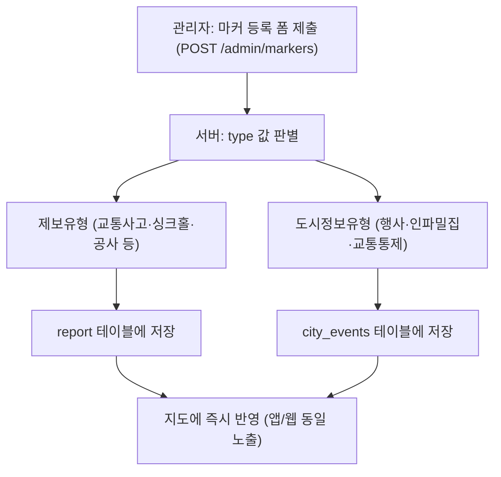
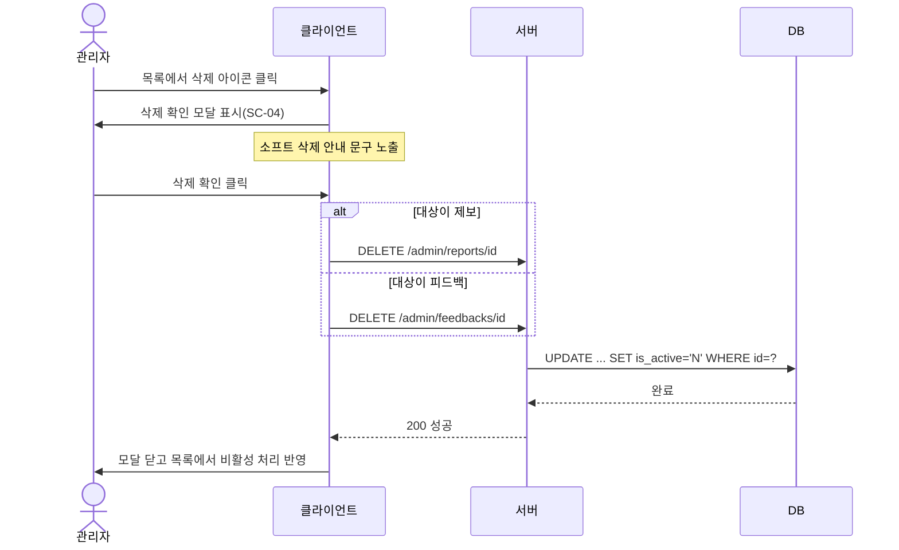

# 시퀀스다이어그램 / 플로우차트 (v1.0)

## 1. 개요

| 항목 | 내용 |
|---|---|
| 범위 | 관리자 페이지(FN-05-01) + 유저 피드백 게시판(FN-03-01) 담당 시나리오 |
| 표기법 | Mermaid (`sequenceDiagram`, `flowchart`) — GitHub/Notion 등에서 바로 렌더링 가능 |
| 근거 문서 | 기능명세서 v1.2, API명세서 v1.2, UI 설계서 2종 |

---

## 2. 로그인

이메일/비밀번호 인증 후 JWT를 발급하는 공통 흐름. 비밀번호 불일치(401)와 비활성 계정(403)을 분기 처리한다.

---

## 3. 피드백 게시판 진입 (지도 버튼 경로)

지도 메인 화면에서 "피드백 게시판" 버튼을 눌러 격자 선택 모드로 전환한 뒤, 지도에서 구역을 클릭해 해당 격자의 게시판으로 진입하는 흐름 (인포카드 경유 경로와 별개의 단축 경로).

---

## 4. 피드백 등록/수정 (중복 등록 사전 차단)

"피드백 남기기" 클릭 시, 먼저 본인 작성 여부를 확인해서 등록/수정 폼을 자동으로 분기한다. 동일 유저-동일 격자 중복 등록은 이 사전 확인으로 원천 차단하고, 409는 동시 요청 등 예외 상황의 안전장치로만 유지한다.

---

## 5. 관리자 마커 등록 라우팅

관리자가 마커 등록 폼(SC-05)을 제출하면, 서버가 `type` 값을 판별해 제보 유형은 `report` 테이블에, 도시정보 유형은 `city_events` 테이블에 자동으로 저장한다. 관리자는 폼 하나만 사용하고 라우팅은 서버가 처리한다.

---

## 6. 관리자 삭제 (소프트 삭제)

제보/피드백 삭제는 동일한 패턴을 공유한다: 확인 모달(SC-04) → API 호출 → `is_active='N'`으로 소프트 삭제 → 목록 갱신.

---

## 7. 다루지 않은 것 (분기 없는 단순 조회)

아래는 "필터 선택 → GET 호출 → 목록 표시"로 끝나는 단순 흐름이라 별도 다이어그램 없이 API명세서 참고로 충분하다고 판단했다.

- 관리자 대시보드 조회 (`GET /admin/summary`)
- 관리자 제보/피드백/도시정보 목록 + 필터 조회
